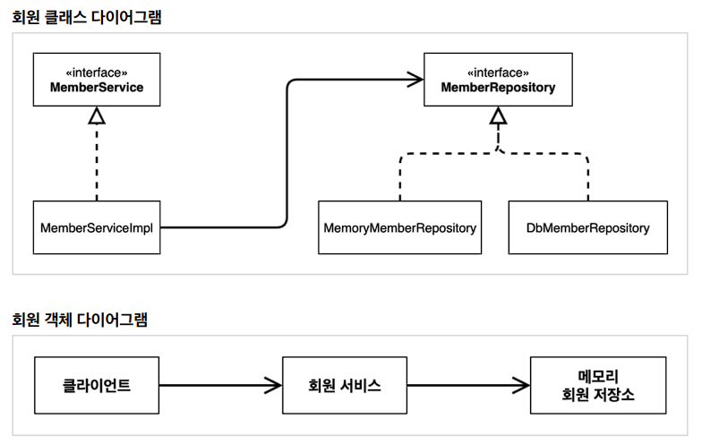

# 스프링 핵심 원리 - 기본편

## 목차
- [1. 객체 지향 설계와 스프링](#1-객체-지향-설계와-스프링)
- [2. 스프링 핵심 원리 이해1 - 예제 만들기](#2-스프링-핵심-원리-이해1---예제-만들기)
- [3. 스프링 핵심 원리 이해2 - 객체 지향 원리 적용](#3-스프링-핵심-원리-이해2---객체-지향-원리-적용)
- [4. 스프링 컨테이너와 스프링 빈](#4-스프링-컨테이너와-스프링-빈)
- [5. 싱글톤 컨테이너](#5-싱글톤-컨테이너)
- [6. 컴포넌트 스캔](#6-컴포넌트-스캔)
- [7. 의존관계 자동 주입](#7-의존관계-자동-주입)
- [8. 빈 생명주기 콜백](#8-빈-생명주기-콜백)
- [9. 빈 스코프](#9-빈-스코프)
- [10. 다음으로](#10-다음으로)
<br><br>

## 1. 객체 지향 설계와 스프링

- 스프링이란?
  - 스프링의 진짜 핵심
    - 스프링은 자바 언어 기반의 프레임워크
    - 자바 언어의 가장 큰 특징 : 객체 지향 언어
    - 스프링은 객체 지향 언어가 가진 강력한 특징을 살려내는 프레임워크
    - 스프링은 좋은 객체 지향 애플리케이션을 개발할 수 있게 도와주는 프레임워크
      <br><br>
- 좋은 객체 지향 프로그래밍이란?
  - 객체 지향 프로그래밍
    - 컴퓨터 프로그램을 명령어의 목록으로 보는 시각에서 벗어나 여러 개의 독립된 단위, 즉 "객체"들의 모임으로 파악하고자 하는 것이다. 각각의 객체는 메시지를 주고받고, 데이터를 처리할 수 있다. (협력)
      <br><br>
  - 객체 지향 프로그래밍은 프로그램을 유연하고 변경이 용이하게 만들기 때문에 대규모 소프트웨어 개발에 많이 사용한다.
      - 유연하고, 변경이 용이?
          - 컴포넌트를 쉽고 유연하게 변경하면서 개발할 수 있는 방법 -> 다형성
            <br><br>
  - 다형성의 실세계 비유
    - 실세계와 객체 지향을 1:1로 매칭X
    - 그래도 실세계의 비유로 이해하기에는 좋음
    - **역할**과 **구현**으로 세상을 구분
      - ex) 운전자 - 자동차
        ```
        운전자 역할	->	자동차 역할
                                          자동차 구현
                    K3	  아반떼      테슬라3
        ```
        - 클라이언트에게 영향을 주지 않고 새로운 기능을 추가할 수 있다
        
      - ex) 공연무대 로미오와 줄리엣 공연
        ```
          로미오 역할	  -	  줄리엣 역할

         장동건	 원빈	 김태희	  송혜교
        ```
        - 역할을 누가하든 상관없다.
        - 줄리엣 역할이 바뀐다고해서 로미오 역할에 영향이 없다.
          <br><br>
  - 역할과 구현을 분리
    - 역할과 구현으로 구분하면 세상이 단순해지고, 유연해지며 변경도 편리해진다.
    - 장점
      - 클라이언트는 대상의 역할(인터페이스)만 알면 된다.
      - 클라이언트는 구현 대상의 내부 구조를 몰라도 된다.
      - 클라이언트는 구현 대상의 내부 구조가 변경되어도 영향을 받지 않는다.
      - 클라이언트는 구현 대상 자체를 변경해도 영향을 받지 않는다.
        <br><br>
  - 자바 언어
    - 자바 언어의 다형성을 활용
      - 역할 = 인터페이스
      - 구현 = 인터페이스를 구현한 클래스, 구현 객체
    - 객체를 설계할 때 역할과 구현을 명확히 분리
    - 객체 설계시 역할(인터페이스)을 먼저 부여하고, 그 역할을 수행하는 구현 객체 만들기
      <br><br>
  - 객체의 협력이라는 관계부터 생각
    - 혼자 있는 객체는 없다.
    - 클라이언트: 요청, 서버: 응답
    - 수 많은 객체 클라이언트와 객체 서버는 서로 협력 관계를 가진다.
      <br><br>
  - 다형성의 본질
    - 인터페이스를 구현한 객체 인스턴스를 실행 시점에 유연하과게 변경할 수 있다.
    - 다형성의 본질을 이햐하려면 협력이라는 객체사이의 관계에서 시작해야함
    - 클라이언트를 변경하지 않고, 서버의 구현 기능을 유연하게 변경할 수 있다.
      <br><br>
  ### 역할과 구현의 분리
  - 정리
    - 실세계의 역할과 구현이라는 편리한 컨셉을 다형성을 통해 객체 세상으로 가져올 수 있음
    - 유연하고, 변경이 용이
    - 확장 가능한 설계
    - 클라이언트에 영향을 주지 않는 변경 가능
    - 인터페이스를 안정적으로 잘 설계하는 것이 중요
  - 한계
    - 역할(인터페이스)자체가 변하며, 클라이언트, 서버 모두에 큰 변경이 발생한다.
    - 자동차를 비행기로 변경해야 한다면?
    - 대본 자체가 변경된다면?
    - USB 인터페이스가 변경된다면?
    - 인터페이스를 안정적으로 잘 설계하는 것이 중요
      <br><br>
  ### 스프링과 객체 지향
    - 다형성이 가장 중요하다.
    - 스프링은 다형성을 극대화해서 이용할 수 있게 도와준다.
    - 스프링에서 이야기하는 제어의 역전(IoC), 의존관계 주입(DI)은 다형성을 활용해서 역할과 구현을 편리하게 다룰 수 있도록 지원한다.
    - 스프링을 사용하면 마치 레고 블럭 조립하듯이! 공연 무대의 배우를 선택하듯이! 구현을 편리하게 변경할 수 있다.

<br><br>
- 좋은 객체 지향 설계의 5가지 원칙(SOLID)
  - SOLID
    - 클린코드로 유명한 로버트 마틴이 좋은 객체 지향 설계의 5가지 원칙을 정리
      <br><br>
    - SRP: 단일 책임 원칙(single responsibility principle)
    - OCP: 개방-폐쇄 원칙(Open/closed principle)
    - LSP: 리스코프 치환 원칙(Liskov substitution principle)
    - ISP: 인터페이스 분리 원칙(InterFace segregation principle)
    - DIP: 의존관계 역전 원칙(Dependency inversion principle)
      <br><br>
    1. SRP 단일 책임 원칙 (Single responsibility principle)
       - 한 클래스는 하나의 책임만 가져야 한다.
       - 하나의 책임이라는 것은 모호하다.
         - 클 수 있고, 작을 수 있다.
         - 문맥과 상황에 따라 다르다.
       - 중요한 기준은 변경이다. 변경이 있을 때 파급 효과가 적으면 단일 책임 원칙을 잘 따른 것
         - 예) UI 변경, 객체의 생성과 사용을 분리
           <br><br>
    2. OCP 개방-폐쇄 원칙 (Open/closed principle) -> 가장 중요하다
       - 소프트웨어 요소는 확장에는 열려 있으나 변경에는 닫혀 있어야 한다.
       - 이런 거짓말 같은 말이? 확장을 하려면, 당연히 기존 코드를 변경?
       - 다형성을 활용해보자
       - 인터페이스를 구현한 새로운 클래스를 하나 만들어서 새로운 기능을 구현
       - 지금까지 배운 역할과 구현의 분리를 생각해보자
         <br><br>
       - 문제점
       - MemberService 클라이언트가 구현 클래스를 직접 선택
       - MemberRepository m = new MemoryMemberRepository(); // 기존코드
       - MemberRepository m = new JdbcMemberRepository(); // 변경코드
       - 구현 객체를 변경하려면 클라이언트 코드를 변경해야 한다.
       - 분명 다형성을 사용했지만 OCP 원칙을 지킬 수 없다.
       - 이 문제를 어떻게 해결해야 하나?
       - 객체를 생성하고, 연관관계를 맺어주는 별도의 조립, 설정자가 필요하다.
         <br><br>
    3. LSP: 리스코프 치환 원칙 (Liskov substitution principle)
       - 프로그램의 객체는 프로그램의 정확성을 깨뜨리지 않으면서 하위 타입의 인스턴스로 바꿀 수 있어야 한다.
       - 다형성에서 하위 클래스는 인터페이스 규약을 다 지켜야 한다는 것, 다형성을 지원하기 위한 원칙, 인터페이스를 구현한 구현체를 믿고 사용하려면, 이 원칙이 필요하다.
       - 단순히 컴파일에 성공하는 것을 넘어서는 이야기
         - 예) 자동차 인터페이스의 엑셀은 앞으로 가라는 기능, 뒤로 가게 구현하면 LSP 위반, 느리더라도 앞으로 가야함
           <br><br>
    4. ISP: 인터페이스 분리 원칙 (InterFace segregation principle)
       - 특정 클라이언트를 위한 인터페이스 여러 개가 범용 인터페이스 하나보다 낫다
       - 자동차 인터페이스 -> 운전 인터페이스, 정비 인터페이스로 분리
       - 사용자 클라이언트 -> 운전자 클라이언트, 정비사 클라이언트로 분리
       - 분리하면 정비 인터페이스 자체가 변해도 운전자 클라이언트에 영향을 주지 않음
       - 인터페이스가 명확해지고, 대체 가능성이 높아진다.
         <br><br>
    5. DIP: 의존관계 역전 원칙 (Dependency inversion principle)
       - 프로그래머는 "추상화에 의존해야지, 구체화에 의존하면 안된다." 의존성 주입은 이 원칙을 따르는 방법 중 하나다.
       - 쉽게 이야기해서 구현 클래스에 의존하지 말거, 인터페이스에 의존해라
       - 앞에서 이야기한 역할(Role)에 의존하게 해야 한다는 것과 같다. 객체 세상도 클라이언트가 인터페이스에 의존해야 유연하게 구현체를 변경할 수 있다.
       - 구현체에 의존하게 되면 변경이 아주 아려워진다.
       - 그런데 OCP에서 설명한 MemberService는 인터페이스에 의존하지만, 구현 클래스도 동시에 의존한다.
       - MemberService 클라이언트가 구현 클래스를 직접 선택
       - MemberRepository m = new MemoryMemberRepository();
       - DIP 위반?
         <br><br>
    ### 정리
       - 객체 지향의 핵심은 다형성
       - 다형성 만으로는 쉽게 부품을 갈아 끼우듯이 개발할 수 없다.
       - 다형성 만으로는 구현 객체를 변경할 때 클라이언트 코드도 함께 변경된다.
       - 다형성 만으로는 OCP, DIP를 지킬 수 없다.
       - 뭔가 더 필요하다.

<br><br>
- 객체 지향 설계와 스프링
  - 다시 스프링으로
    - 스프링 이야기에 왜 객체 지향 이야기가 나오는가?
      <br><br>
    - 스프링은 다음 기술로 다형성 + OCP, DIP를 가능하게 지원
    - DI(Dependency Injection): 의존관계, 의존성 주입
    - DI 컨테이너 제공
    - 클라이언트 코드의 변경 없이 기능 확장
    - 쉽게 부품을 교체하듯이 개발

<br><br>
  - 스프링이 없던 시절로   
    - 옛날 어떤 개발자가 좋은객체 지향 개발을 하려고 OCP, DIP 원칙을 지키면서 개발을 해보니, 너무 할일이 많았다. 배보다 배꼽이크다. 그래서 프레임워크로 만들어버림
    - 순수하게 자바로 OCP, DIP 원칙들을 지키면서 개발을 해보면, 결국 스프링 프레임워크를 만들게 된다. (더 정확히는 DI 컨테이너)
    - DI 개념은 말로 설명해도 이해가 잘 안된다. 코드로 짜봐야 필요성을 알게된다!
      - 그러면 이제 스프링이 왜? 만들어졌는지 코드로 이해해보자
        <br><br>
  ### 정리
   - 모든 설계에 역할과 구현을 분리하자
   - 자동차, 공연의 예를 떠올려보자
   - 애플리케이션 설계도 공연을 설계 하듯이 배역만 만들어두고, 배우는 언제든지 유연하게 변경할 수 있도록 만드는 것이 좋은 객체 지향 설계다.
   - 이상적으로는 모든 설계에 인터페이스를 부여하자
     <br><br>
   - 실무 고민
     - 하지만 인터페이스를 도입하면 추상화라는 비용이 발생한다.
     - 기능을 확장할 가능성이 없다면, 구체 클래스를 직접 사용하고, 향후 꼭 필요할 때 리팩터링해서 인터페이스를 도입하는 것도 방법이다.


## 2. 스프링 핵심 원리 이해1 - 예제 만들기
- 비즈니스 요구사항과 설계
  - 회원
    - 회원을 가입하고 조회할 수 있다.
    - 회원은 일반과 VIP 두 가지 등급이 있다.
    - 회원 데이터는 자체 DB를 구축할 수 있고, 외부 시스템과 연동할 수 있다.(미확정)
      <br><br>
  - 주문과 할인 정책
    - 회원은 상품을 주문할 수 있다.
    - 회원 등급에 따라 할인 정책을 적용할 수 있다.
    - 할인 정책은 모든 VIP는 1000원을 할인 해주는 고정 금액 할인을 적용해달라. (나중에 변경 될 수 있다.)
    - 할인 정책은 변경 가능성이 높다. 회사의 기본 할인 정책을 아직 정하지 못했고, 오픈 직전까지 고민을 미루고 싶다. 최악의 경우 할인을 적용하지 않을 수도 있다. (미확정)
  
  - 요구사항을 보면 회원 데이터, 할인 정책 같은 부분은 지금 결정하기 어려운 부분이다. 그렇다고 이런 정책이 결정될 때 까지 개발을 무기한 기다릴 수도 없다. 우리는 앞에서 배운 객체 지향 설계 방법이 있지 않은가!

  - 인터페이스를 만들고 구현체를 언제든지 갈아끼울 수 있도록 설계하면 된다.
    - 참고: 프로젝트 환경설정을 편리하게 하려고 스프링 부트를 사용한 것이다. 지금은 스프링 없는 순수한 자바로만 개발을 진행한다는 점을 꼭 기억하자! 스프링 관련은 한참 뒤에 등장한다.
      <br><br> 
- 회원 도메인 설계
  <br><br>
  
<br><br>
  
  <br><br>
  - 회원 서비스: **MemberServiceImpl**

- 회원 도메인 개발
  - 생성자 자동완성 alt + insert(fn + f10)
  - 변수 추출하기 ctrl + alt + v
    <br><br>
  - 데이터베이스가 아직 확정이 안되었다. 그래도 개발은 진행해야 하니 가장 단순한, 메모리 회원 저장소를 구
    현해서 우선 개발을 진행하자.
    - 참고: HashMap 은 동시성 이슈가 발생할 수 있다. 이런 경우 ConcurrentHashMap 을 사용하자
      <br><br>
- 회원 도메인 실행과 테스트
  - 애플리케이션 로직으로 이렇게 테스트 하는 것은 좋은 방법이 아니다. JUnit 테스트를 사용하자.
  - 회원 도메인 설계의 문제점
    - 이 코드의 설계상 문제점은 무엇일까요?
        - 다른 저장소로 변경할 때 OCP 원칙을 잘 준수할까요?
        - DIP를 잘 지키고 있을까요?
        - 의존관계가 인터페이스 뿐만 아니라 구현까지 모두 의존하는 문제점이 있음
          - 주문까지 만들고나서 문제점과 해결 방안을 설명
            <br><br>
- 주문과 할인 도메인 설계
  - 주문과 할인 정책
    - 회원은 상품을 주문할 수 있다.
    - 회원 등급에 따라 할인 정책을 적용할 수 있다.
    - 할인 정책은 모든 VIP는 1000원을 할인해주는 고정 금액 할인을 적용해달라. (나중에 변경 될 수 있다.)
    - 할인 정책은 변경 가능성이 높다. 회사의 기본 할인 정책을 아직 정하지 못했고, 오픈 직전까지 고민을 미루고 싶다. 최악의 경우 할인을 적용하지 않을 수도 있다. (미확정)
      <br><br>
    
      <br><br>
    1. **주문 생성**: 클라이언트는 주문 서비스에 주문 생성을 요청한다.
    2. **회원 조회**: 할인을 위해서는 회원 등급이 필요하다. 그래서 주문 서비스는 회원 저장소에서 회원을 조회한다.
    3. **할인 적용**: 주문 서비스는 회원 등급에 따른 할인 여부를 할인 정책에 위임한다.
    4. **주문 결과 반환**: 주문 서비스는 할인 결과를 포함한 주문 결과를 반환한다.
       <br><br>
    - 참고: 실제로는 주문 데이터를 DB에 저장하겠지만, 예제가 너무 복잡해질 수 있어서 생략하고, 단순히 주문 결과를 반환한다.
    <br><br>
    
    <br><br>
  - **역할과 구현을 분리**해서 자유롭게 구현 객체를 조립할 수 있게 설계했다. 덕분에 회원 저장소는 물론이고, 할인 정책도 유연하게 변경할 수 있다.
    <br><br>
  - 주문 도메인 클래스 다이어그램
    <br><br>
    
    <br><br>
  - 주문 도메인 객체 다이어그램1
    <br><br>
    
    <br><br>
    - 회원을 메모리에서 조회하고, 정액 할인 정책(고정 금액)을 지원해도 주문 서비스를 변경하지 않아도 된다.
    - 역할들의 협력 관계를 그대로 재사용할 수 있다.
  - 주문 도메인 객체 다이어그램2
    <br><br>
    
    <br><br>
    - 회원을 메모리가 아닌 실제 DB에서 조회하고, 정률 할인 정책(주문 금액에 따라 % 할인)을 지원해도 주문 서비스를 변경하지 않아도 된다.
    - 협력 관계를 그대로 재사용할 수 있다.
      <br><br>
- 주문과 할인 도메인 개발
  - 주문 생성 요청이 오면, 회원 정보를 조회하고, 할인 정책을 적용한 다음 주문 객체를 생성해서 반환한다.
  - 메모리 회원 리포지토리와, 고정 금액 할인 정책을 구현체로 생성한다.
- 주문과 할인 도메인 실행과 테스트

<br><br>

## 3. 스프링 핵심 원리 이해2 - 객체 지향 원리 적용
- 새로운 할인 정책 개발
  - 새로운 할인 정책을 확장해보자.
  - 이번에는 주문한 금액의 %를 할인해주는 새로운 정률 할인 정책을 추가하자.
  - RateDiscountPolicy 추가
  <br><br>
    
    <br><br>
- 새로운 할인 정책 적용과 문제점
  - 할인 정책을 애플리케이션에 적용해보자.
    - 할인 정책을 변경하려면 클라이언트인 `OrderServiceImpl` 코드를 고쳐야한다.
      ```java
       // private final DiscountPolicy discountPolicy = new FixDiscountPolicy();
       private final DiscountPolicy discountPolicy = new RateDiscountPolicy();
      ```
    - 문제점 발견
      - 우리는 역할과 구현을 충실하게 분리했다.
      - 다형성도 활용하고, 인터페이스와 구현 객체를 분리했다.
      - OCP, DIP 같은 객체지향 설계 원칙을 충실히 준수했다.
        - 그렇게 보이지만 사실은 아니다.
      - DIP: 주문서비스 클라이언트(`OrderServiceImpl`)는 `DiscountPolicy` 인터페이스에 의존하면서 DIP를 지킨거 같은데?
        - 클래스 의존관계를 분석해 보자. 추상(인터페이스) 뿐만 아니라 **구체(구현) 클래스에도 의존**하고 있다.
          - 추상(인터페이스) 의존: `DiscountPolicy`
          - 구체(구현) 클래스: `FixDiscountPolicy`, `RateDiscountPolicy`
      - OCP: 변경하지 않고 확장할 수 있다고 했는데!
        - **지금 코드는 기능을 확장해서 변경하면, 클라이언트 코드에 영향을 준다!** 따라서 **OCP를 위반**한다.
    <br><br>
    - 왜 클라이언트 코드를 변경해야 할까?
      <br><br>
      
      <br><br>
      - 정책 변경
        <br><br>
        
        <br><br>
  - 어떻게 문제를 해결할 수 있을까?
    - 클라이언트 코드인 OrderServiceImpl 은 DiscountPolicy 의 인터페이스 뿐만 아니라 구체 클래스도 함께 의존한다.
    - 그래서 구체 클래스를 변경할 때 클라이언트 코드도 함께 변경해야 한다.
    - DIP 위반 추상에만 의존하도록 변경(인터페이스에만 의존)
    - DIP를 위반하지 않도록 인터페이스에만 의존하도록 의존관계를 변경하면 된다.
       <br><br>
      
      <br><br>
    - 인터페이스에만 의존하도록 설계와 코드를 변경했다.
    - 그런데 구현체가 없는데 어떻게 코드를 실행할 수 있을까?
    - 실제 실행을 해보면 NPE(null pointer exception)가 발생한다.
      <br><br>
  - 해결방안
    - 이 문제를 해결하려면 누군가가 클라이언트인 OrderServiceImpl 에 DiscountPolicy 의 구현 객체를 대신 생성하고 주입해주어야 한다.
      <br><br>
- 관심사의 분리
  - 애플리케이션을 하나의 공연이라 생각해보자. 각각의 인터페이스를 배역(배우 역할)이라 생각하자. 그런데! 실제 배역 맞는 배우를 선택하는 것은 누가 하는가?
  - 로미와 줄리엣 공연을 하면 로미오 역할을 누가 할지 줄리엣 역할을 누가 할지는 배우들이 정하는게 아니다.
    - 이전 코드는 마치 로미오 역할(인터페이스)를 하는 레오나르도 디카프리오(구현체, 배우)가 줄리엣 역할(인터페이스)을 하는 여자 주인공(구현체, 배우)을 직접 초빙하는 것과 같다.
    - 디카프리오는 공연도 해야하고 동시에 여자 주인공도 공연에 직접 초빙해야 하는 **다양한 책임**을 가지고 있다.
      <br><br>
  - 관심사를 분리하자
    - 배우는 본인의 역할인 배역을 수행하는 것에만 집중해야 한다.
    - 디카프리오는 어떤 여자 주인공이 선택되더라도 똑같이 공연을 할 수 있어야 한다.
    - 공연을 구성하고, 담당 배우를 섭외하고, 역할에 맞는 배우를 지정하는 책임을 담당하는 별도의 **공연 기획자**가 나올 시점이다.
    - 공연 기획자를 만들고, 배우와 공연 기획자의 책임을 확실히 분리하자.
    <br><br>
  - AppConfig 등장
    - 애플리케이션의 전체 동작 방식을 구성(config)하기 위해, **구현 객체를 생성**하고, **연결**하는 책임을 가지는 별도의 설정 클래스를 만들자.
    - AppConfig는 애플리케이션의 실제 동작에 필요한 **구현 객체를 생성**한다.
      - MemberServiceImpl
      - MemoryMemberRepository
      - OrderServiceImpl
      - FixDiscountPolicy
    - AppConfig는 생성한 객체 인스턴스의 참조(레퍼런스)를 **생성자를 통해서 주입(연결)** 해준다.
      - MemberServiceImpl -> MemoryMemberRepository
      - OrderServiceImpl -> MemoryMemberRepository, FixDiscountPolicy
        <br><br>
    - 설계 변경으로 `MemberServiceImpl`은 `MemoryMemberRepository`를 의존하지 않는다.
    - 단지 `MemberRepository` 인터페이스만 의존한다.
    - `MemberServiceImpl` 입장에서 생성자를 통해 어떤 구현 객체가 들어올지(주입될지)는 알 수 없다.
    - `MemberServiceImpl`의 생성자를 통해서 어떤 구현 객체를 주입할지는 오직 외부(`AppConfig`)에서 결정된다.
    - `MemberServiceImpl`은 이제부터 **의존관계에 대한 고민은 외부**에 맡기고 **실행에만 집중**하면 된다.
      <br><br>
    - 클래스 다이어그램
      <br><br>
      
      <br><br>
      - 객체의 생성과 연결은 AppConfig가 담당한다.
      - **DIP 완성**: MemberServiceImpl은 MemberRepository인 추상에만 의존하면 된다. 이제 구체 클래스를 몰라도 된다.
      - **관심사의 분리**: 객체를 생성하고 연결하는 역할과 실행하는 역할이 명확히 분리되었다.
        <br><br>
    - 회원 객체 인스턴스 다이어그램
      <br><br>
      
      <br><br>
      - `AppConfig` 객체는 `MemoryMemberRepository`객체를 생성하고 그 참조값을 `MemberServiceImpl`을 생성하면서 생성자로 전달한다.
      - 클라이언트인 `MembverServiceImpl` 입장에서 보면 의존관계를 마치 외부에서 주입해주는 것 같다고 해서 DI(Dependency Injection) 우리말로 의존관계 주입 또는 의존성 주입이라 한다.
        <br><br>
    - OrderServiceImpl - 생성자 주입
      - 설계 변경으로 `OrderServiceImpl`은 `FixDiscountPolicy`를 의존하지 않는다!
      - 단지 `DiscountPolicy` 인터페이스만 의존한다.
      - `OrderServiceImpl`입장에서 생성자를 통해 어떤 구현 객체가 들어올지(주입될지)는 알 수 없다.
      - `OrderServiceImpl`의 생성자를 통해서 어떤 구현 객체를 주입할지는 오직 외부(`AppConfig`)에서 결정한다.
      - `OrderServiceImpl`은 이제부터 실행에만 집중하면 된다.
      <br><br>
      - `OrderServiceImpl`에는 `MemoryMemberRepository`,`FixDiscountPolicy` 객체의 의존관계가 주입된다.
      <br><br>
  - AppConfig 실행
    - 사용 클래스 : MemberApp
    - 사용 클래스 : OrderApp
    - 테스트 코드 오류 수정
      <br><br>
    - 테스트 코드에서 `@BeforeEach`는 각 테스트를 실행하기 전에 호출된다.
      <br><br>
- 정리
  - AppConfig를 통해서 관심사를 확실하게 분리했다.
  - 배역, 배우를 생각해보자.
  - AppConfig는 공연 기획자다.
  - AppConfig는 구체 클래스를 선택한다. 배역에 맞는 담당 배우를 선택한다. 애플리케이션이 어떻게 동작해야 할지 전체 구성을 책임진다.
  - 이제 각 배우들은 담당 기능을 실행하는 책임만 지면 된다.
  - `OrderServiceImpl`은 기능을 실행하는 책임만 지면 된다.
      
    <br><br>
- AppConfig 리팩터링
  - 현재 AppConfig를 보면 **중복**이 있고, **역할**에 따른 **구현**이 잘 안보인다.
    - 기대하는 그림
      
      <br><br>
    - 리펙터링 전
      - 중복을 제거하고, 역할에 따른 구현이 보이도록 리팩터링 하자.
    - 리펙터링 후
      - `new MemoryMemberRepository()`이 부분이 중복 제거되었다. 이제 `MemoryMemberRepository`를 다른 구현체로 변경할 때 한 부분만 변경하면 된다.
      - `AppConfig`를 보면 역할과 구현 클래스가 한눈에 들어온다. 애플리케이션 전체 구성이 어떻게 되어있는지 빠르게 파악할 수 있다.
        <br><br>
      
- 새로운 구조와 할인 정책 적용
  - 처음으로 돌아가서 정액 할인 정책을 정률% 할인 정책으로 변경해보자.
  - FixDiscountPolicy -> RateDiscountPolicy
  - 어떤 부분만 변경하면 되겠는가?
    <br><br>
    AppConfig의 등장으로 애플리케이션이 크게 사용 영역과, 객체를 생성하고 구성(Configuration)하는 영역으로 분리되었다.
    <br><br>
    
    <br><br>
    
    <br><br>
  - `FixDiscountPolicy` -> `RateDiscountPolicy`로 변경해도 구성 영역만 영향을 받고, 사용 영역은 전혀 영향을 받지 않는다.
    <br><br>
  - 할인 정책 변경 구성 코드
    - `AppConfig`에서 할인 정책 역할을 담당하는 구현을 `FixDiscountPolicy` -> `RateDiscountPolicy` 객체로 변경했다.
    - 이제 할인 정책을 변경해도, 애플리케이션의 구성 역할을 담당하는 AppConfig만 변경하면 된다. 클라이언트 코드인 `OrderServiceImpl`를 포함해서 **사용 영역**의 어떤 코드도 변경할 필요가 없다.
    - **구성 영역**은 당연히 변경된다. 구성 역할을 담당하는 AppConfig를 애플리케이션이라는 공연의 기획자로 생각하자. 공연 기획자는 공연 참여자인 구현 객체들을 모두 알아야 한다.
  <br><br>
- 전체 흐름 정리
  - 새로운 할인 정책 개발
    - 다형성 덕분에 새로운 정률 할인 정책 코드를 추가로 개발하는 것 자체는 아무 문제가 없음
      <br><br>
  - 새로운 할인 정책 적용과 문제점
    - 새로 개발한 정률 할인 정책을 적용하려고 하니 **클라이언트 코드**인 주문 서비스 구현체도 함께 변경해야함
    - 주문 서비스 클라이언트가 인터페이스인 `DiscountPolicy`뿐만 아니라, 구체 클래스인 `FixDiscountPolicy`도 함께 의존 -> **DIP 위반**
      <br><br>
  - 관심사의 분리
    - 애플리케이션을 하나의 공연으로 생각
    - 기존에는 클라이언트가 의존하는 서버 구현 객체를 직접 생성하고, 실행함
    - 비유를 하면 기존에는 남자 주인공 배우가 공연도 하고, 동시에 여자 주인공도 직접 초빙하는 다양한 책임을 가지고 있음
    - 공연을 구성하고, 담당 배우를 섭외하고, 지정하는 책임을 담당하는 별도의 **공연 기획자**가 나올 시점
    - 공연 기획자인 AppConfig가 등장
    - AppConfig는 애플리케이션의 전체 동작 방식을 구성하기 위해, **구현 객체를 생성**하고, **연결**하는 책임
    - 이제부터 클라이언트 객체는 자신의 역할을 실행하는 것만 집중, 권한이 줄어듬(책임이 명확해짐)
      <br><br>
  - AppConfig 리팩터링
    - 구성 정보에서 역할과 구현을 명확하게 분리
    - 역할이 잘 들어남
    - 중복 제거
      <br><br>
  - 새로운 구조와 할인 정책 적용
    - 정액 할인 정책 -> 정률% 할인 정책으로 변경
    - AppConfig의 등장으로 애플리케이션이 크게 **사용 영역**과, 객체를 생성하고 **구성하는 영역**으로 분리
    - 할인 정책을 변경해도 AppConfig가 있는 구성 영역만 변경하면 됨, 사용 영역은 변경할 필요가 없음, 물론 클라이언트 코드인 주문 서비스 코드도 변경하지 않음
      <br><br>

- 좋은 객체 지향 설계의 5가지 원칙의 적용
  - 여기서 3가지 SRP, DIP, OCP 적용
    <br><br>
  - SRP 단일 책임 원칙
    - **한 클래스는 하나의 책임만 가져야 한다.**
      <br><br>
    - 클라이언트 객체는 직접 구현 객체를 생성하고, 연결하고, 실행하는 다양한 책임을 가지고 있음
    - SRP 단일 책임 원칙을 따른면서 관심사를 부닐함
    - 구현 객체를 생성하고 연결하는 책임은 AppConfig가 담당
    - 클라이언트 객체는 실행하는 책임만 담당
      <br><br>
  - DIP 의존관계 역전 원칙
    - **프로그래머는 "추상화에 의존해야지, 구체화에 의존하면 안된다." 의존성 주입은 이 원칙을 따르는 방법 중 하나다.**
      <br><br>
    - 새로운 할인 정책을 개발하고, 적용하려고 하니 클라이언트 코드도 함께 변경해야 했다. 왜냐하면 기존 클라이언트 코드(`OrderServiceImpl`)는 DIP를 지키며 `DiscountPolicy`추상화 인터페이스에 의존하는 것 같았지만, `FixDiscountPolicy` 구체화 구현 클래스에도 함께 의존했다.
    - 클라이언트 코드가 `DiscountPolicy` 추상화 인터페이스에만 의존하도록 코드를 변경했다.
    - 하지만 클라이언트 코드는 인터페이스만으로는 아무것도 실행할 수 없다.
    - AppConfig가 `FixDiscountPolicy`객체 인스턴스를 클라이언트 코드 대신 생성해서 클라이언트 코드에 의존관계를 주입했다. 이렇게해서 DIP 원칙을 따르면서 문제도 해결했다.
      <br><br>
  - OCP
    - **소프트웨어 욧호는 확장에는 열려 있으나 변경에는 닫혀 있어야 한다.**
      <br><br>
    - 다형성 사용하고 클라이언트 DIP를 지킴
    - 애플리케이션을 사용 영역과 구성 영역으로 나눔
    - AppConfig가 의존관계를 `FixDiscountPolicy` -> `RateDiscountPolicy`로 변경해서 클라이언트 코드에 주입하므로 클라이언트 코드는 변경하지 않아도 됨
    - **소프트웨어 요소를 새롭게 확장해도 사용 영역의 변경은 닫혀 있다!.**
      <br><br>
    
- IoC, DI, 그리고 컨테이너
  - 제어의 역전 IoC(Inversion of Control)
    - 기존 프로그램은 클라이언트 구현 객체가 스스로 필요한 서버 구현 객체를 생성하고, 연결하고, 실행했다. 한마디로 구현 객체가 프로그램의 제어 흐름을 스스로 조종했다. 개발자 입장에서는 자연스러운 흐름이다.
    - 반면에 AppConfig가 등장한 이후에 구현 객체는 자신의 로직을 실행하는 역할만 담당한다. 프로그램의 제어 흐름은 이제 AppConfig가 가져간다.
      예를 들어서 `OrderServiceImpl`은 필요한 인터페이스들을 호출하지만 어떤 구현 객체들이 실행될지 모른다.
    - 프로그램에 대한 제어 흐름에 대한 권한은 모두 AppConfig가 가지고 있다. 심지어 `OrderServiceImpl`도 AppConfig가 생성한다.
      그리고 AppConfig는 `OrderServiceImpl`이 아닌 OrderService 인터페이스의 다른 구현 객체를 생성하고 실행할 수 있다.
      그런 사실도 모른체 `OrderServiceImpl`은 묵묵히 자신의 로직을 실행할 뿐이다.
    - 이렇듯 프로그램의 제어 흐름을 직접 제어하는 것이 아니라 외부에서 관리하는 것을 제어의 역전(IoC)이라 한다.
      <br><br>
  - 프레임워크 vs 라이브러리
    - 프레임워크가 내가 작성한 코드를 제어하고, 대신 실행하면 그것은 프레임워크가 맞다. (JUnit)
    - 반면에 내가 작성한 코드가 직접 제어의 흐름을 담당한다면 그것은 프레임워크가 아니라 라이브러리다.
      <br><br>
  - 의존관계 주입 DI(Dependency Injection)
    - `OrderServiceImpl`은 `DiscountPolicy`인터페이스에 의존한다. 실제 어떤 구현 객체가 사용될지는 모른다.
    - 의존관계는 **정적인 클래스 의존 관계와, 실행 시점에 결정되는 동적인 객체(인스턴스) 의존 관계** 둘을 분리해서 생각해야 한다.
      <br><br>
      - 정적인 클래스 의존관계
        - 클래스가 사용하는 import 코드만 보고 의존관계를 쉽게 판단할 수 있다. 정적인 의존관계는 애플리케이션을 실행하지 않아도 분석할 수 있ㅎ다. 클래스 다이어그램을 보자
        - `OrderServiceImpl`은 `MemberRepository`, `DiscountPolicy`에 의존한다는 것을 알 수 있다.
        - 그런데 이러한 클래스 의존관계 만으로는 실제 어떤 객체가 `OrderSerivceImpl`에 주입될지 알 수 없다.
          <br><br>
        - 클래스 다이어그램
          
          <br><br>
      - 동적인 객체 인스턴스 의존 관계
        - 애플리케이션 실행 시점에 실제 생성된 객체 **인스턴스의** 참조가 연결된 의존 관계다.
        - 
        - 애플리케이션 **실행 시점(런타임)** 에 외부에서 실제 구현 객체를 생성하고 클라이언트에 전달해서 클라이언트와 서버의 실제 의존관계가 연결 되는 것을 **의존관계 주입**이라 한다.
        - 객체 인스턴스를 생성하고, 그 참조값을 전달해서 연결된다.
        - 의존관계 주입을 사용하면 클라이언트 코드를 변경하지 않고, 클라이언트가 호출하는 대상의 타입 인스턴스를 변경할 수 있다.
        - 의존관계 주입을 사용하면 정적인 클래스 의존관계를 반영하지 않고, 동적인 객체 인스턴스 의존관계를 쉽게 변경할 수 있다.
          <br><br>
  - IoC 컨테이너, DI 컨테이너
    - AppConfig 처럼 객체를 생성하고 관리하면서 의존관계를 연결해 주는 것을
    - IoC 컨테이너 또는 DI 컨테이너라 한다.
    - 의존관계 주입에 초점을 맞추어 최근에는 주로 DI 컨테이너라 한다.
    - 또는 어샘블러, 오브젝트 팩토리 등으로 불리기도 한다
      <br><br>
- 스프링으로 전환하기
  - 지금까지 순수한 자바 코드만으로 DI를 적용했다. 이제 스프링을 사용해보자.
    <br><br>
  - 스프링 컨테이너
    - `ApplicationContext`를 스프링 컨테이너라 한다.
    - 기존에는 개발자가 `AppConfig`를 사용해서 직접 객체를 생성하고 DI를 했지만, 이제부터는 스프링 컨테이너를 통해서 사용한다.
    - 스프링 컨테이너는 `@Configuration`이 붙은 `AppConfig`를 설정(구성) 정보로 사용한다. 여기서 `@Bean`이라 적힌 메서들르 모두 호출해서 반환된 객체를 스프링 컨테이너에 등록한다. 이렇게 스프링 컨테이너에 등록된 객체를 스프링 빈이라 한다.
    - 스프링 빈은 `@Bean`이 붙은 메서드의 명을 스프링 빈의 이름으로 사용한다. (`memberService`, `orderService`)
    - 이전에는 개발자가 필요한 객체를 `AppConfig`를 사용해서 직접 조회했지만, 이제부터는 스프링 컨테이너를 통해서 필요한 스프링 빈(객체)를 찾아야 한다. 스프링 빈은 `applicationContext.getBean()`메서드를 사용해서 찾을 수 있다.
    - 기존에는 개발자가 직접 자바코드로 모든 것을 했다면 이제부터는 스프링 컨테이너에 객체를 스프링 빈으로 등록하고, 스프링 컨테이너에서 스프링 빈을 찾아서 사용하도록 변경되었다.
      <br><br>
    - 코드가 약간 더 복잡해진 것 같은데, 스프링 컨테이너를 사용하면 어떤 장점이 있을까?
      <br><br>

## 4. 스프링 컨테이너와 스프링 빈
- 스프링 컨테이너 생성
  ```java
  // 스프링 컨테이너 생성
  ApplicationContext applicationContext = new AnnotationConfigApplicationContext(AppConfig.class);
  ```
  - `ApplicationContext`를 스프링 컨테이너라 한다.
  - `ApplicationContext`는 인터페이스이다.
  - 스프링 컨테이너는 XML을 기반으로 만들 수 있고, 애노테이션 기반의 자바 설정 클래스로 만들 수 있다.
  - 직전에 `AppConfig`를 사용했던 방식이 애노테이션 기반의 자바 설정 클래스로 스프링 컨테이너를 만든 것이다.
  - 자바 설정 클래스를 기반으로 스프링 컨테이너(`ApplicationContext`)를 만들어보자.
    - `new AnnotationConfigApplicationContext(AppConfig.class);`
    - 이 클래스는 `ApplicationContext` 인터페이스의 구현체이다.
<br><br>
    - 참고: 더 정확히는 스프링 컨테이너를 부를 때 `BeanFactory`,`ApplicationContext` 로 구분해서 이야기한다. 
    이 부분은 뒤에서 설명하겠다. `BeanFactory`를 직접 사용하는 경우는 거의 없으므로 일반적으로 `ApplicationContext`를 스프링 컨테이너라 한다.
      <br><br>
- 스프링 컨테이너의 생성 과정
  1. 스프링 컨테이너 생성
    
    - `new AnnotationConfigApplicationContext(AppConfig.class)`
    - 스프링 컨테이너를 생성할 때는 구성 정보를 지정해주어야 한다.
    - 여기서는 `AppConfig.class`를 구성 정보로 지정했다.
      <br><br>
  2. 스프링 빈 등록
    
    - 스프링 컨테이너는 피라미터로 넘어온 설정 클래스 정보를 사용해서 스프링 빈을 등록한다.
      <br><br>
      빈 이름
    - 빈 이름은 메서드 이름을 사용한다.
    - 빈 이름을 직접 부여할 수도 있다.
    - `@Bean(name="memberService2")`
      <br><br>
    - 주의: **빈 이름은 항상 다른 이름을 부여**해야 한다. 같은 이름을 부여하면, 다른 빈이 무시되거나, 기존 빈을 덮어버리거나 설정에 따라 오류가 발생한다.
      <br><br>
  3. 스프링 빈 의존관계 설정 - 준비
    
     <br><br>
  4. 스프링 빈 의존관계 설정 - 완료
    
    - 스프링 컨테이너는 설정 정보를 참고해서 의존관계를 주입(DI)한다.
    - 단순히 자바 코드를 호출하는 것 같지만, 차이가 있다. 이 차이는 뒤에 싱글톤 컨테이너에서 설명한다.
      <br><br>
    - 참고: 스프링 빈을 생성하고, 의존관계를 주입하는 단계가 나누어져 있다. 그런데 이렇게 자바 코드로 스프링 빈을 등록하면 생성자를 호출하면서 의존관계 주입도 한번에 처리된다.
    여기서는 이해를 돕기 위해 개념적으로 나누어 설명했다. 자세한 내용은 의존관계 자동 주입에서 다시 설명하겠다.
## 5. 싱글톤 컨테이너
## 6. 컴포넌트 스캔
## 7. 의존관계 자동 주입
## 8. 빈 생명주기 콜백
## 9. 빈 스코프
## 10. 다음으로